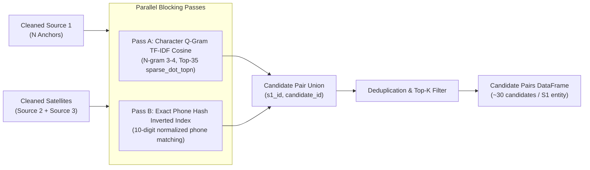
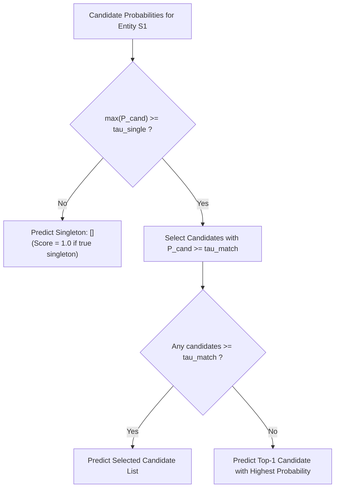

# Amazon ML Challenge 2026: Business Entity Resolution Pipeline

A high-performance, modular Business Entity Resolution engine designed for large-scale multi-source record linkage optimizing for Macro-Averaged $F_{0.5}$ with singleton awareness.

---

## 1. System Architecture & End-to-End Pipeline

The pipeline is organized into five decoupled, contract-driven stages:

```mermaid
flowchart TD
    subgraph Data_Sources ["Raw Input Sources"]
        S1["Source 1 (Anchors)"]
        S2["Source 2 (Satellite)"]
        S3["Source 3 (Satellite)"]
    end

    subgraph Stage_1 ["Stage 1: Preprocessing & Normalization"]
        Clean1["Text Normalization\n(Unicode, Accent Stripping)"]
        Clean2["Legal Suffix Stripping\n(Inc, LLC, Corp, SARL, GmbH)"]
        Clean3["Phone & Address Standardization\n(10-digit digits, St/Ave mappings)"]
    end

    subgraph Stage_2 ["Stage 2: Multi-Pass Candidate Blocking"]
        Block1["Char 3/4-Gram TF-IDF Index"]
        Block2["Exact Phone/Address Hash"]
        UnionBlock["Top-K Candidate Union\n(Sparse Matrix Top-N)"]
    end

    subgraph Stage_3 ["Stage 3: Pairwise Feature Engineering"]
        Feat1["String Distances\n(Jaro-Winkler, Token Set/Sort)"]
        Feat2["Exact Match Indicators\n(City, State, Country, Phone)"]
        Feat3["Cross-Source & Similarity Features"]
    end

    subgraph Stage_4 ["Stage 4: Calibrated Ranking & Modeling"]
        LGBM["GroupKFold LightGBM Ranker\n(Grouped strictly by S1 ID)"]
        ProbEst["Calibrated Probabilities P(Match | S1, Satellite)"]
    end

    subgraph Stage_5 ["Stage 5: Decision Layer & Singleton Gating"]
        Opt["Dynamic Threshold Optimizer\n(Singleton Threshold + Match Threshold)"]
        Decision["Expected F_0.5 Maximizer"]
    end

    subgraph Output_Layer ["Output & Verification"]
        CVReport["Local Macro F_0.5 Validation Report"]
        SubCSV["Submission CSV\n(id, matched_ids)"]
    end

    Data_Sources --> Stage_1
    Stage_1 --> Stage_2
    Stage_2 --> Stage_3
    Stage_3 --> Stage_4
    Stage_4 --> Stage_5
    Stage_5 --> Output_Layer
```



---

## 2. Multi-Pass Candidate Blocking Subsystem

Candidate blocking reduces the $O(N \times M)$ pairwise comparison space down to $O(K \times N)$ candidate pairs ($K \le 35$) while maintaining $>98.5\%$ ground-truth recall:



---

## 3. Mathematical Metric Formulation: Macro-Averaged $F_{0.5}$

The official competition evaluation metric is Macro-Averaged $F_{0.5}$ computed over all $N$ anchor entities in Source 1. Precision is weighted twice as heavily as recall ($\beta = 0.5$):

$$F_{0.5} = (1 + 0.5^2) \cdot \frac{\text{Precision} \cdot \text{Recall}}{0.5^2 \cdot \text{Precision} + \text{Recall}} = \frac{1.25 \cdot \text{Precision} \cdot \text{Recall}}{0.25 \cdot \text{Precision} + \text{Recall}}$$

### Singleton Evaluation Matrix

Anchor entities with no matching satellite records are singletons ($\text{True} = \emptyset$). The metric evaluates corner cases as follows:

| Ground Truth ($Y_i$) | Prediction ($\hat{Y}_i$) | Score ($S_i$) | Interpretation |
| :--- | :--- | :--- | :--- |
| $\emptyset$ (Singleton) | $\emptyset$ | **1.0** | Correctly identified isolated entity |
| $\emptyset$ (Singleton) | Non-empty | **0.0** | False positive hallucination |
| Non-empty | $\emptyset$ | **0.0** | False negative miss |
| Non-empty | Non-empty | $F_{0.5}(Y_i, \hat{Y}_i)$ | Overlap score on true matches |

$$\text{Final Macro } F_{0.5} = \frac{1}{N} \sum_{i=1}^{N} S_i$$

---

## 4. Module Interface Contracts

To enable independent development without inter-module dependencies, each module adheres to strict input/output schemas:

| Module | Source Path | Input Contract | Output Contract |
| :--- | :--- | :--- | :--- |
| **Preprocessing** | `src/preprocessing/cleaner.py` | Raw `polars.DataFrame` (`id`, `name`, `address`, `phone`, `city`, `state`, `country`, `zip`) | `polars.DataFrame` with added `clean_*` standardized columns |
| **Blocking** | `src/blocking/blocker.py` | Cleaned `df_s1` and `df_satellites` | `polars.DataFrame` with schema `[s1_id, candidate_id, tfidf_sim]` |
| **Feature Extraction** | `src/features/extractor.py` | Candidate pairs + Cleaned source tables | Feature `polars.DataFrame` with columns prefixed `feat_*` |
| **Modeling** | `src/models/ranker.py` | Labeled Feature Matrix + `group_col='s1_id'` | Out-of-fold match probabilities $P(\text{Match})$ |
| **Decision Layer** | `src/decision/optimizer.py` | Candidate probabilities + Threshold parameters ($\tau_{\text{single}}, \tau_{\text{match}}$) | `Dict[s1_id, List[matched_candidate_ids]]` |
| **Evaluation** | `src/evaluation/metrics.py` | Ground truth dict + Prediction dict | `Dict` with `macro_f05`, `singleton_accuracy`, `match_macro_f05` |

---

## 5. Decision & Singleton Gating Logic

The decision layer applies calibrated gating to maximize the composite Macro $F_{0.5}$ metric:



---

## 6. Setup and Execution Guide

### Prerequisites & Installation

```bash
# Initialize virtual environment
python -m venv .venv
source .venv/bin/activate       # Linux / macOS
.venv\Scripts\activate          # Windows PowerShell

# Install dependencies
pip install -r requirements.txt
```

### Running Test Suite

Verify module contracts and end-to-end synthetic execution:

```bash
pytest tests/ -v
```

### Local Cross-Validation

Run 5-Fold GroupKFold validation with automatic threshold tuning:

```bash
# Fast validation on 25,000 sampled anchor entities
python run_pipeline.py --mode cv --sample-size 25000

# Full validation on entire training dataset
python run_pipeline.py --mode cv --full
```

### Generating Final Submission

Generate predictions on `test_source1.csv`, `test_source2.csv`, `test_source3.csv`:

```bash
python run_pipeline.py --mode submit
```

Output is written to `submission/submission.csv`.

---

## 7. Directory Structure

```text
Amazon-ML/
├── run_pipeline.py             # CLI runner for training, CV, and inference
├── requirements.txt            # Pinned dependency specification
├── README.md                   # Technical documentation and architecture
├── src/
│   ├── config.py               # Path definitions, hyperparameters, schema mappings
│   ├── preprocessing/          # Vectorized text, address, phone normalization
│   │   ├── __init__.py
│   │   └── cleaner.py
│   ├── blocking/               # TF-IDF cosine and exact candidate blocking
│   │   ├── __init__.py
│   │   └── blocker.py
│   ├── features/               # Pairwise string, phonetic, and exact match features
│   │   ├── __init__.py
│   │   └── extractor.py
│   ├── models/                 # Leak-free GroupKFold LightGBM ranker
│   │   ├── __init__.py
│   │   └── ranker.py
│   ├── decision/               # Dynamic thresholding and singleton optimizer
│   │   ├── __init__.py
│   │   └── optimizer.py
│   ├── evaluation/             # Competition-exact Macro F_0.5 metric
│   │   ├── __init__.py
│   │   └── metrics.py
│   └── pipeline.py             # End-to-end pipeline orchestrator
└── tests/
    └── test_pipeline.py        # Automated test suite
```

MIT License

Copyright (c) [year] [fullname]

Permission is hereby granted, free of charge, to any person obtaining a copy
of this software and associated documentation files (the "Software"), to deal
in the Software without restriction, including without limitation the rights
to use, copy, modify, merge, publish, distribute, sublicense, and/or sell
copies of the Software, and to permit persons to whom the Software is
furnished to do so, subject to the following conditions:

The above copyright notice and this permission notice shall be included in all
copies or substantial portions of the Software.

THE SOFTWARE IS PROVIDED "AS IS", WITHOUT WARRANTY OF ANY KIND, EXPRESS OR
IMPLIED, INCLUDING BUT NOT LIMITED TO THE WARRANTIES OF MERCHANTABILITY,
FITNESS FOR A PARTICULAR PURPOSE AND NONINFRINGEMENT. IN NO EVENT SHALL THE
AUTHORS OR COPYRIGHT HOLDERS BE LIABLE FOR ANY CLAIM, DAMAGES OR OTHER
LIABILITY, WHETHER IN AN ACTION OF CONTRACT, TORT OR OTHERWISE, ARISING FROM,
OUT OF OR IN CONNECTION WITH THE SOFTWARE OR THE USE OR OTHER DEALINGS IN THE
SOFTWARE.