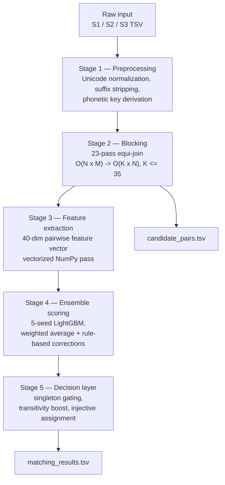
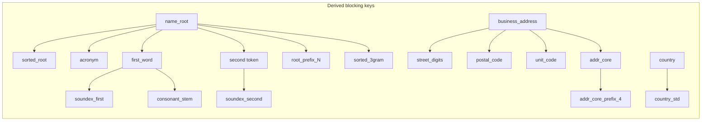
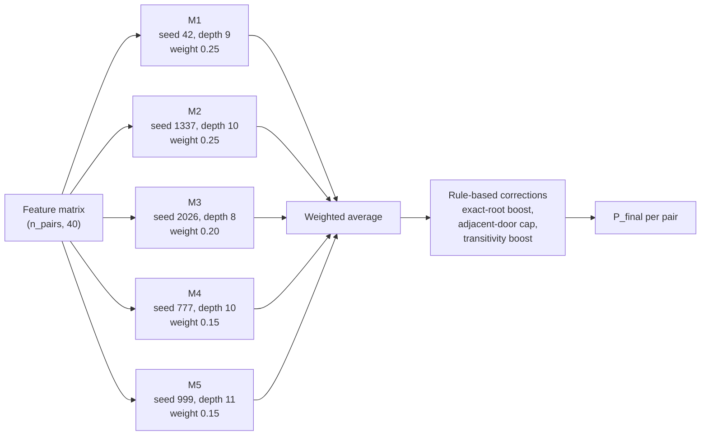
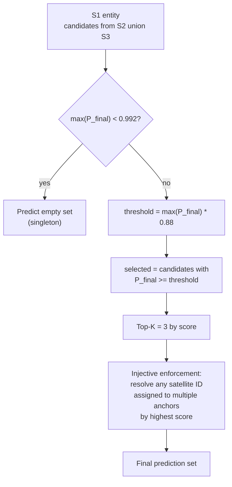

# Business Entity Resolution — Amazon ML Challenge 2026

Multi-source record linkage across three heterogeneous business entity datasets. Given 1,732,544 anchor entities in Source 1, the system predicts the corresponding matching record(s), if any, in Source 2 and Source 3.

| Metric | Value |
|---|---|
| Public leaderboard (Macro F0.5) | 0.762 |
| Offline holdout (Macro F0.5) | 0.7779 |
| Precision | 84.04% |
| Recall | 68.49% |

---

## Table of Contents

1. [Problem Formulation](#1-problem-formulation)
2. [Pipeline Architecture](#2-pipeline-architecture)
3. [Candidate Blocking](#3-candidate-blocking)
4. [Feature Engineering](#4-feature-engineering)
5. [Ensemble Model](#5-ensemble-model)
6. [Decision Layer](#6-decision-layer)
7. [Evaluation Metric](#7-evaluation-metric)
8. [Precision/Recall Trade-off](#8-precisionrecall-trade-off)
9. [Module Contracts](#9-module-contracts)
10. [Repository Layout](#10-repository-layout)
11. [Setup and Execution](#11-setup-and-execution)
12. [Dependencies](#12-dependencies)

---

## 1. Problem Formulation

Three independent sources hold partial, noisy fragments of information describing the same underlying business entities.

```
Source 1  (anchors)     1,732,544 entities — reference set to resolve against
Source 2  (satellite A) independent business registry
Source 3  (satellite B) independent business registry
```

For each Source 1 record, the task is to identify which Source 2 / Source 3 records — if any — describe the same physical entity.

**Constraints:**

- **Scale.** A full cross-product comparison across sources is `O(N x M)` and intractable at this N. Blocking is mandatory and is graded as a separate output.
- **Noise.** Name transliteration across scripts, inconsistent legal-suffix usage, non-standard address abbreviations.
- **Singletons.** A large fraction of Source 1 anchors have no counterpart in Source 2 or Source 3. Correctly predicting an empty match set scores 1.0 for that entity; incorrectly predicting a non-empty set scores 0.0, regardless of how close the guess was.
- **Multilingual text.** Records span Latin script, French, and Indic-script transliterations, among others.

---

## 2. Pipeline Architecture


```mermaid
flowchart TD
    A["Raw input\nS1 / S2 / S3 TSV"] --> B["Stage 1 — Preprocessing\nUnicode normalization, suffix stripping,\nphonetic key derivation"]
    B --> C["Stage 2 — Blocking\n23-pass equi-join\nO(N x M) -> O(K x N), K <= 35"]
    C --> D["Stage 3 — Feature extraction\n40-dim pairwise feature vector\nvectorized NumPy pass"]
    D --> E["Stage 4 — Ensemble scoring\n5-seed LightGBM,\nweighted average + rule-based corrections"]
    E --> F["Stage 5 — Decision layer\nsingleton gating,\ntransitivity boost, injective assignment"]
    F --> G["matching_results.tsv"]
    C --> H["candidate_pairs.tsv"]
```

| Stage | Responsibility | Output |
|---|---|---|
| 1. Preprocessing | Normalize text, derive phonetic/structural keys | Enriched source tables |
| 2. Blocking | Reduce search space via composite-key equi-joins | `(s1_id, cand_id)` candidate pairs |
| 3. Feature extraction | Compute 40 similarity/structural features per pair | Feature matrix |
| 4. Ensemble scoring | Predict `P(match)` per pair, apply correction rules | Calibrated match probabilities |
| 5. Decision layer | Threshold, deduplicate, enforce 1-to-1 assignment | Final prediction set per anchor |

---

## 3. Candidate Blocking

23 deterministic equi-join passes generate the candidate set. Each pass joins on a composite key; all passes are unioned and deduplicated on `(s1_id, cand_id)`. Country-scoped joins prevent cross-region false positives except where explicitly marked as a global fallback.


```mermaid
flowchart LR
    subgraph Keys["Derived blocking keys"]
        NR["name_root"] --> SR["sorted_root"]
        NR --> AC["acronym"]
        NR --> FW["first_word"]
        FW --> SF["soundex_first"]
        FW --> CS["consonant_stem"]
        NR --> S2W["second token"] --> SS["soundex_second"]
        NR --> RP["root_prefix_N"]
        NR --> G3["sorted_3gram"]
        BA["business_address"] --> SD["street_digits"]
        BA --> PC["postal_code"]
        BA --> UC["unit_code"]
        BA --> ACORE["addr_core"] --> AP4["addr_core_prefix_4"]
        CO["country"] --> CSTD["country_std"]
    end
```

| Pass | Category | Key A | Key B | Key C | Top-K | Rationale |
|:--:|---|---|---|---|:--:|---|
| 1 | Name Exact | `name` | `country_std` | — | 4 | Identical cleaned name, same country |
| 2 | Name Stem | `name_root` | `country_std` | — | 4 | Suffix-stripped root match within country |
| 3 | Name Token-Sort | `sorted_root` | `country_std` | — | 3 | Word-order-agnostic root match |
| 4 | Address + Name | `street_digits` | `root_prefix_3` | `country_std` | 4 | Door number + name prefix |
| 5 | Unit + Name | `unit_code` | `root_prefix_3` | `country_std` | 3 | Suite/shop number + name prefix |
| 6 | PIN + Name | `postal_code` | `root_prefix_3` | `country_std` | 4 | Postal code + name prefix |
| 7 | PIN + Street | `postal_code` | `street_digits` | `country_std` | 3 | Postcode + door number, transliteration-robust |
| 8 | Phonetic + PIN | `soundex_first` | `postal_code` | `country_std` | 4 | Phonetic first word + postal area |
| 9 | Phonetic + Street | `soundex_first` | `street_digits` | `country_std` | 4 | Phonetic first word + door number |
| 10 | Consonant + PIN | `consonant_stem` | `postal_code` | `country_std` | 3 | Script-independent skeleton + postcode |
| 11 | Consonant + Street | `consonant_stem` | `street_digits` | `country_std` | 3 | Consonant skeleton + door number |
| 12 | Acronym + Street | `acronym` | `street_digits` | `country_std` | 3 | Abbreviated vs. full name, same address |
| 13 | Phonetic2 + PIN | `soundex_second` | `postal_code` | `country_std` | 3 | Second-word phonetic + postcode |
| 14 | Phonetic2 + Street | `soundex_second` | `street_digits` | `country_std` | 3 | Second-word phonetic + door number |
| 15 | Addr Prefix + PIN | `addr_core_prefix_4` | `postal_code` | `country_std` | 3 | Stripped address prefix + postcode |
| 16 | 3-Key Address | `root_prefix_2` | `street_digits` | `postal_code` | 3 | Triple anchor, high precision |
| 17 | 3-Gram + PIN | `sorted_3gram` | `postal_code` | `country_std` | 3 | Character 3-gram signature + postcode |
| 18 | Unit + PIN | `unit_code` | `postal_code` | `country_std` | 3 | Suite number + postal code |
| 19 | Addr Core Exact | `addr_core` (>=8 chars) | `country_std` | — | 3 | Long stripped-address exact match |
| 20 | Phonetic + Addr | `soundex_first` | `addr_core_prefix_4` | `country_std` | 3 | Phonetic name + address prefix |
| 21 | Name + PIN (global) | `name_root` (>=5 chars) | `postal_code` | — | 2 | Country-agnostic fallback |
| 22 | Consonant + Addr | `consonant_stem` | `addr_core_prefix_4` | `country_std` | 3 | Consonant skeleton + address prefix |
| 23 | First Word + Street | `first_word` (>=4 chars) | `street_digits` | `country_std` | 3 | First meaningful word + door number |

**Derived key definitions:**

| Key | Source field | Derivation |
|---|---|---|
| `name_root` | `business_name` | Strip legal prefixes/suffixes (Inc, LLC, SARL, GmbH, SAS, EURL, ...), leet-normalize, lowercase |
| `sorted_root` | `name_root` | Alphabetically sort tokens of `name_root` and rejoin |
| `acronym` | `name_root` | First character of each `name_root` token, concatenated |
| `first_word` | `name_root` | First token of `name_root` |
| `soundex_first` | `first_word` | 4-character Soundex code |
| `soundex_second` | second token of `name_root` | Soundex code |
| `consonant_stem` | `first_word` | First 3 consonants — script-independent skeleton |
| `sorted_3gram` | `name_root` | Alphabetically sorted characters of the first 4-char prefix |
| `root_prefix_N` | `name_root` | First N characters, N in {2, 3, 4, 5} |
| `street_digits` | `business_address` | Leading digit sequence (door/building number) |
| `postal_code` | `business_address` | 5–6 digit postal code, regex-extracted |
| `unit_code` | `business_address` | Suite/unit/flat number, regex-extracted |
| `addr_core` | `business_address` | Address with street-type tokens stripped (rue, ave, blvd, ...) |
| `addr_core_prefix_4` | `addr_core` | First 4 characters |
| `country_std` | `country` | Canonicalized country code (e.g. "United States" -> `us`) |

---

## 4. Feature Engineering

Each candidate pair is reduced to a 40-dimensional feature vector, computed in a single vectorized NumPy pass.

| Index | Feature | Description |
|--:|---|---|
| 0 | `exact_name` | Exact cleaned-name match |
| 1 | `exact_root` | Exact `name_root` match |
| 2 | `jw_root` | Jaro-Winkler similarity on `name_root` |
| 3 | `sort_root` | Token sort ratio on `name_root` |
| 4 | `set_root` | Token set ratio on `name_root` |
| 5 | `partial_root` | Partial string ratio on `name_root` |
| 6 | `lev_root` | Normalized Levenshtein similarity on `name_root` |
| 7 | `qratio_root` | Quick ratio on `name_root` |
| 8 | `len_diff_ratio` | Absolute length difference / max length |
| 9 | `acronym_match` | Acronym-to-root or acronym-to-acronym equality |
| 10 | `soundex_match` | Soundex equality on first word |
| 11 | `consonant_match` | Consonant skeleton equality (>=2 consonants) |
| 12 | `jw_soundex` | Jaro-Winkler on Soundex codes |
| 13 | `jw_addr` | Jaro-Winkler on standardized address |
| 14 | `sort_addr` | Token sort ratio on address |
| 15 | `set_addr` | Token set ratio on address |
| 16 | `lev_addr` | Normalized Levenshtein on address |
| 17 | `core_addr_sort` | Token sort on `addr_core` |
| 18 | `core_addr_set` | Token set on `addr_core` |
| 19 | `core_addr_lev` | Levenshtein on `addr_core` |
| 20 | `same_digits` | `street_digits` equality |
| 21 | `diff_digits` | `street_digits` inequality |
| 22 | `digit_num_diff` | Numeric door-number delta, clipped to 50 |
| 23 | `same_unit` | `unit_code` equality |
| 24 | `same_pin` | `postal_code` equality |
| 25 | `diff_pin` | `postal_code` inequality |
| 26 | `same_country` | `country_std` equality |
| 27 | `translit_flag` | `sort_addr >= 0.70` and `same_digits = 1` |
| 28 | `composite` | `max(jw_root, sort_root, acronym_match) * sort_addr` |
| 29 | `addr_match_score` | `0.7 * sort_addr + 0.3 * same_digits` |
| 30 | `pin_and_digits` | `same_pin = 1` and `same_digits = 1` |
| 31 | `phonetic_addr_composite` | `max(soundex_match, consonant_match) * sort_addr` |
| 32 | `strong_exact_pair` | `exact_root = 1` and (`same_digits = 1` or `same_pin = 1`) |
| 33 | `root_contains` | Substring containment between roots (>=4 chars each) |
| 34 | `exact_full_addr` | Full standardized address exact match |
| 35 | `exact_root_and_pin` | `exact_root = 1` and `same_pin = 1` |
| 36 | `exact_addr_core` | `addr_core` exact match (>=6 chars) |
| 37 | `shared_tokens` | Token Jaccard: `\|tokens1 ∩ tokens2\| / \|tokens1 ∪ tokens2\|` |
| 38 | `adjacent_door_penalty` | Numeric door delta in `[1, 4]` — near-miss signal |
| 39 | `sort_set_diff` | `\|sort_root - set_root\|` — disambiguation signal |

---

## 5. Ensemble Model

Five LightGBM binary classifiers are trained independently with distinct seeds, depths, and regularization strengths. Final probability is a fixed weighted average:

```
P_final = 0.25*P1 + 0.25*P2 + 0.20*P3 + 0.15*P4 + 0.15*P5
```


```mermaid
flowchart LR
    F["Feature matrix\n(n_pairs, 40)"] --> M1["M1\nseed 42, depth 9\nweight 0.25"]
    F --> M2["M2\nseed 1337, depth 10\nweight 0.25"]
    F --> M3["M3\nseed 2026, depth 8\nweight 0.20"]
    F --> M4["M4\nseed 777, depth 10\nweight 0.15"]
    F --> M5["M5\nseed 999, depth 11\nweight 0.15"]
    M1 --> W["Weighted average"]
    M2 --> W
    M3 --> W
    M4 --> W
    M5 --> W
    W --> R["Rule-based corrections\nexact-root boost,\nadjacent-door cap,\ntransitivity boost"]
    R --> P["P_final per pair"]
```

**Model configurations:**

| Model | Weight | Seed | LR | Leaves | Depth | pos_weight | reg_alpha | reg_lambda | Rounds | Role |
|---|:--:|--:|--:|--:|--:|--:|--:|--:|--:|---|
| M1 | 0.25 | 42 | 0.050 | 85 | 9 | 1.30 | 0.05 | 0.5 | 200 | Primary anchor — balanced generalization |
| M2 | 0.25 | 1337 | 0.045 | 95 | 10 | 1.25 | 0.10 | 0.8 | 220 | Primary anchor — higher L1/L2 regularization |
| M3 | 0.20 | 2026 | 0.055 | 75 | 8 | 1.35 | 0.08 | 0.6 | 180 | Shallower trees — reduces overfit on noisy pairs |
| M4 | 0.15 | 777 | 0.040 | 105 | 10 | 1.20 | 0.12 | 0.9 | 240 | Wider leaves — complex address interactions |
| M5 | 0.15 | 999 | 0.035 | 120 | 11 | 1.25 | 0.15 | 1.0 | 260 | Deepest/widest — diversity, high regularization |

`pos_weight` upweights the positive (match) class to offset class imbalance. `reg_alpha` / `reg_lambda` apply L1/L2 regularization on leaf weights. M1 and M2 carry the highest weight, reflecting the best individual cross-validation scores.

**Post-ensemble probability corrections:**

| Rule | Condition | Effect |
|---|---|---|
| Exact-root boost | `exact_root=1` and (`same_digits=1` or `same_pin=1`) | `P_final = max(P_final, 0.998)` |
| Adjacent-door penalty | `adjacent_door_penalty=1` and `exact_root=0` | `P_final = min(P_final, 0.75)` |
| Transitivity booster | S2 and S3 both score `>= 0.88` for the same S1 anchor | S2 score multiplied by `1.015` |

---

## 6. Decision Layer


```mermaid
flowchart TD
    S["S1 entity\ncandidates from S2 union S3"] --> Q{"max(P_final) < 0.992?"}
    Q -- yes --> N["Predict empty set\n(singleton)"]
    Q -- no --> T["threshold = max(P_final) * 0.88"]
    T --> SEL["selected = candidates with\nP_final >= threshold"]
    SEL --> TOPK["Top-K = 3 by score"]
    TOPK --> INJ["Injective enforcement:\nresolve any satellite ID\nassigned to multiple anchors\nby highest score"]
    INJ --> OUT["Final prediction set"]
```

**Tuned hyperparameters (offline holdout Macro F0.5 = 0.7779):**

| Parameter | Value | Description |
|---|---|---|
| `PROB_CUTOFF` | 0.992 | Minimum max-score required to predict a non-empty set |
| `MARGIN_RATIO` | 0.88 | Fraction of the max score used as the secondary-candidate threshold |
| `TOP_K` | 3 | Maximum candidates retained per anchor |
| `CHUNK_SIZE` | 200,000 | Streaming inference chunk size (memory cap < 8.5 GB) |

---

## 7. Evaluation Metric

Macro-averaged $F_{0.5}$, computed per anchor entity and averaged over all N entities.

$$F_{0.5} = \frac{(1 + 0.5^2) \cdot P \cdot R}{0.5^2 \cdot P + R} = \frac{1.25 \cdot P \cdot R}{0.25 \cdot P + R}$$

With $\beta = 0.5$, precision is weighted four times more heavily than recall.

**Per-entity scoring:**

| Ground truth | Prediction | Score |
|---|---|:--:|
| Empty (singleton) | Empty | 1.0 |
| Empty (singleton) | Non-empty | 0.0 |
| Non-empty | Empty | 0.0 |
| Non-empty | Non-empty | $F_{0.5}$(ground truth, prediction) |

$$\text{Macro } F_{0.5} = \frac{1}{N} \sum_{i=1}^{N} S_i$$

A false positive on a singleton entity is not partially penalized — it contributes a full $-1/N$ to the macro average. Singleton precision is therefore as consequential as pairwise accuracy on true matches.

---

## 8. Precision/Recall Trade-off

Two strategies were evaluated on a 50,000-entity holdout:

| Strategy | Macro F0.5 | Precision | Recall | Notes |
|---|:--:|--:|--:|---|
| LightGBM ensemble (submitted) | 0.7779 | 84.04% | 68.49% | Final submission |
| Rule-only precision maximizer | 0.3523 | 99.10% | 20.44% | Recall collapse — not submitted |

Despite $\beta=0.5$ weighting precision heavily, a strategy that maximizes precision at the expense of recall still collapses the macro score, because non-empty ground-truth entities with an empty prediction score zero regardless of precision elsewhere.

**Threshold sensitivity (`PROB_CUTOFF`), offline holdout:**

| PROB_CUTOFF | Macro F0.5 | Precision | Recall |
|:--:|:--:|--:|--:|
| 0.990 | 0.7752 | 82.1% | 70.3% |
| **0.992** | **0.7779** | **84.04%** | **68.49%** |
| 0.994 | 0.7703 | 86.5% | 65.1% |
| 0.996 | 0.7580 | 89.2% | 60.4% |

`PROB_CUTOFF = 0.992` sits at the empirical optimum on this holdout; higher cutoffs trade recall faster than they gain precision, and lower cutoffs give up precision faster than the recall gain justifies.

---

## 9. Module Contracts

| Module | Path | Input | Output |
|---|---|---|---|
| Preprocessing | `src/preprocessing/cleaner.py` | Raw Polars DataFrame (`id`, `business_name`, `business_address`, `country`) | DataFrame with `name_root`, `soundex_*`, `consonant_stem`, `postal_code`, `street_digits` columns |
| Blocking | `src/blocking/blocker.py` | Cleaned `df_s1`, `df_satellites` | DataFrame: `[s1_id, cand_id]` |
| Feature extraction | `src/features/extractor.py` | Candidate pairs + cleaned source tables | NumPy array `(n_pairs, 40)` |
| Modeling | `src/models/ranker.py` | Feature matrix + labels | Match probability per pair |
| Decision layer | `src/decision/optimizer.py` | Candidate probabilities + thresholds | `Dict[s1_id -> List[cand_id]]` |
| Evaluation | `src/evaluation/metrics.py` | Ground truth dict + prediction dict | `{macro_f05, precision, recall, singleton_accuracy}` |

---

## 10. Repository Layout

```
Amazon-ML/
├── lgbm_grandmaster.py              # Production inference engine (5-seed ensemble, 23-pass blocking)
├── run_pipeline.py                  # CLI orchestrator (cv / submit modes)
├── requirements.txt                 # Pinned dependency specification
├── README.md
│
├── src/
│   ├── config.py                    # Dataset paths, hyperparameter registry
│   ├── preprocessing/
│   │   └── cleaner.py               # Vectorized Polars text normalization
│   ├── blocking/
│   │   └── blocker.py               # Multi-pass equi-join candidate generator
│   ├── features/
│   │   └── extractor.py             # 40-feature pairwise extractor (NumPy)
│   ├── models/
│   │   └── ranker.py                # LightGBM binary classifier trainer
│   ├── decision/
│   │   └── optimizer.py             # Singleton gating and threshold optimizer
│   ├── evaluation/
│   │   └── metrics.py               # Competition-exact Macro F0.5 implementation
│   └── pipeline.py                  # End-to-end pipeline orchestrator
│
├── output/
│   ├── matching_results.tsv         # Final submission file (1,732,544 rows)
│   └── candidate_pairs.tsv          # Blocking candidate output (graded separately)
│
├── tests/
│   └── test_pipeline.py             # Automated test suite
│
├── aws_09_autonomous_champion.py    # Hyperparameter search / ablation runner (EC2)
├── calibrate_precision_099.py       # Experimental high-precision submission generator
└── 6ab10eb3b23ba_student_resource/  # Official competition dataset and validator
    └── student_resource/
        ├── dataset/
        │   ├── train_source1.tsv
        │   ├── train_source2.tsv
        │   ├── train_source3.tsv
        │   ├── train_gt.tsv
        │   ├── test_source1.tsv
        │   ├── test_source2.tsv
        │   └── test_source3.tsv
        └── utils/
            └── validate_submission.py
```

---

## 11. Setup and Execution

### Prerequisites

```bash
python -m venv .venv
source .venv/bin/activate          # Linux / macOS
.venv\Scripts\activate             # Windows PowerShell

pip install -r requirements.txt
```

### Validate submission format

```bash
python 6ab10eb3b23ba_student_resource/student_resource/utils/validate_submission.py \
    --matching output/matching_results.tsv \
    --test-dir 6ab10eb3b23ba_student_resource/student_resource/dataset/test
```

### Run local offline benchmark

```bash
# Cross-validation on a training sample
python run_pipeline.py --mode cv --sample-size 25000

# Full training set validation
python run_pipeline.py --mode cv --full
```

### Generate final submission

```bash
python lgbm_grandmaster.py
```

Writes `output/matching_results.tsv` and `output/candidate_pairs.tsv`.

### Run test suite

```bash
pytest tests/ -v
```

---

## 12. Dependencies

| Package | Version | Role |
|---|---|---|
| `polars` | >= 1.0.0 | Columnar DataFrame operations (preprocessing, blocking) |
| `numpy` | >= 1.24.0 | Feature matrix construction |
| `lightgbm` | >= 4.0.0 | Gradient-boosted binary classifier (5-model ensemble) |
| `rapidfuzz` | >= 3.0.0 | Jaro-Winkler, Levenshtein, token-ratio computations |
| `scikit-learn` | >= 1.3.0 | GroupKFold cross-validation utilities |
| `scipy` | >= 1.10.0 | Sparse matrix operations |
| `pyarrow` | >= 12.0.0 | Parquet/Arrow I/O backend for Polars |
| `jellyfish` | >= 1.0.0 | Phonetic encoding (Soundex, NYSIIS) |

---

## Leaderboard

| Submission | Score | Timestamp | Status |
|---|---|---|---|
| LightGBM ensemble (`PROB_CUTOFF=0.992`) | 0.762 | Sep 26, 2026 11:41 PM IST | Public |
